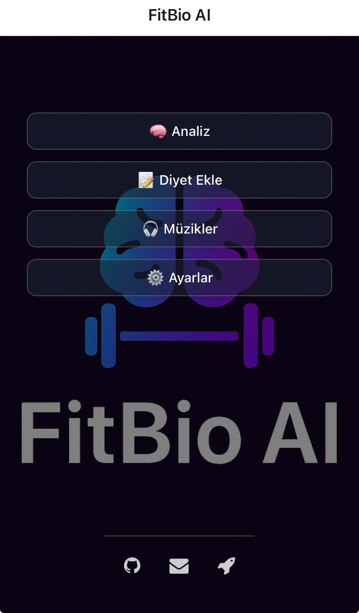

<h1 align="center">🧠 FitBio AI</h1>

<em>Your AI-powered fitness and health assistant</em>

  

---

## 🚀 Features

- 🎯 Goal-based body analysis: muscle gain, fat loss, or maintenance
- 📊 Smart metrics: BMI, BMR, TDEE, fat and muscle mass
- 🧬 AI-powered daily meal plans + manual diet entry support
- 💪 Weekly workout plans by level & focus (home/gym)
- 💊 Supplement recommendations (Creatine, L-Carnitine, etc.)
- 🎧 Workout music player with full playlist control:
  - One-player system
  - Next/Previous song
  - Multi-file support
  - Playlist browsing and real-time controls
- 🔔 Daily reminders (water, training, sleep, supplements)
- 📤 Export to PDF (AI plan, custom diet, training plan)
- ✅ Save and track weekly progress with graphs
- 🌙 Modern UI, dark mode and clean animated interface

---

## 🌟 Pro Version Available

🎉 An advanced **FitBio AI Pro** version is available as a private project. It includes:

- 🧠 Adaptive AI planning based on training time and goals
- 📋 Editable, user-specific meal timing and supplements
- 🧪 Pre-, intra- and post-workout nutritional suggestions
- 🔐 Offline-first storage with backup
- 🎵 Spotify & YouTube Music integration
- 🔄 Dynamic user profiling and goal adjustments
- 🧾 Professional PDF output with advanced formatting

> 🔐 Pro version is available for portfolio, private demo, or professional use upon request.

---

## 📲 Android Downloads

| Format | Description                  | Link |
|--------|------------------------------|------|
| 🔹 APK  | Manual installation for testing | [Download APK](-) |
| 🔸 AAB  | Play Store publishing format    | [Download AAB](-) |

---

## 🧠 About

FitBio AI was developed as a **portfolio project** to showcase a complete cross-platform mobile fitness assistant using:
- React Native (Expo)
- SQLite + AsyncStorage
- Modular utility & AI recommendation systems
- PDF export with HTML render
- Local notification API
- Modern UI with dark mode and animated icons

---

## 👨‍💻 Developer

- 🌐 GitHub: [github.com/ahmtub](https://github.com/ahmtub)
- 📧 Email: ahmetsen53@gmail.com

> 🚀 Plus and Pro versions coming soon – stay tuned!

---

## 📜 License & Usage

This project is intended for educational, demo and portfolio purposes only.  
Unauthorized commercial use is strictly prohibited.  
All rights reserved © 2025 Ahmet Şen
