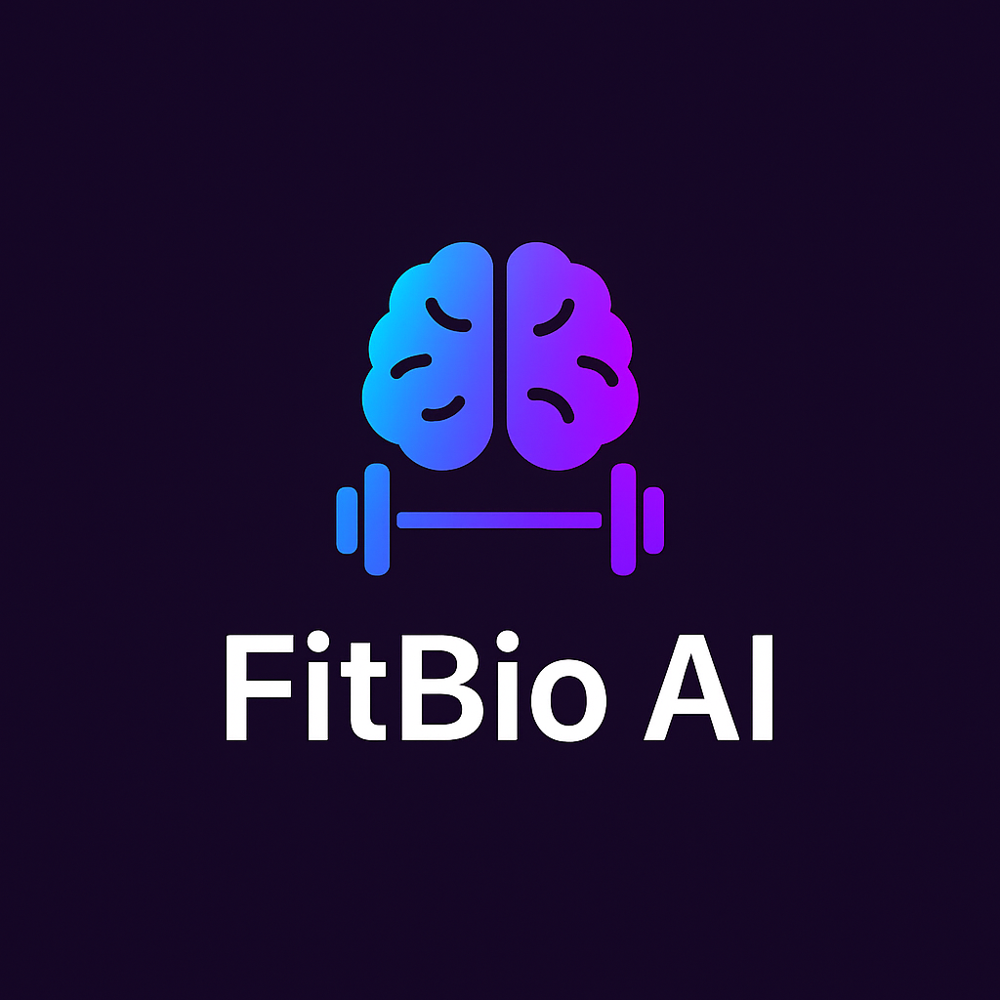

# 🧠 FitBio AI
> *Your AI-powered personal health & fitness assistant.*



FitBio AI, biyolojik verilerinizi analiz eder, hedeflerinize göre (kas yapımı, yağ yakımı, formda kalma) en uygun antrenman, diyet ve takviye programlarını sunar.  
💪 AI tabanlı planlama, 📊 vücut analizleri, 📤 PDF çıktısı ve daha fazlası — hepsi tek uygulamada!

---

## 🚀 Özellikler

| Kategori | Açıklama |
|---------|----------|
| 🎯 **Kişiselleştirme** | Boy, kilo, yaş, cinsiyet, yağ/kas/su oranı ile analiz |
| 🔥 **Metabolizma Hesabı** | Akıllı BMR & TDEE hesaplamaları |
| 💪 **Antrenman Planı** | Hedefe göre (yağ yakımı, kas yapımı, form) + Seviye bazlı (başlangıç, orta, ileri) |
| 🧬 **Takviye Önerileri** | Follistatin, MK-677, Creatine vb. |
| 🥗 **Kültürel Diyetler** | Hedef ve kültüre özel 60+ menü |
| 🎧 **Müzik Kütüphanesi** | Spor sırasında çalabileceğiniz özel playlist |
| 📤 **PDF Çıktısı** | Günlük/haftalık planları dışa aktar |
| 🔔 **Akıllı Hatırlatıcılar** | Su iç, antrenman zamanı, uyku öncesi, takviye bildirimi |
| 📈 **Check-in & Grafikler** | Günlük gelişim takibi |

---

## 🆚 Sürüm Farkları

| Özellik                 | Free    | Plus (🎟️) | Pro (🔥) |
|-------------------------|---------|------------|-----------|
| Temel analiz & plan     | ✅       | ✅          | ✅         |
| Gelişmiş antrenman PDF  | 🚫       | ✅          | ✅         |
| Spotify/YouTube senk.   | 🚫       | ✅          | ✅         |
| Peptid veritabanı       | 🚫       | 🚫          | ✅         |
| Bildirim özelleştirme   | 🚫       | ✅          | ✅         |
| Haftalık e-posta raporu | 🚫       | 🚫          | ✅         |

> ⚙️ Plus/Pro özellikleri yakında açılacak. Geliştirme devam ediyor...

---

## 📲 Platform Desteği

- ✅ Android (.apk / Google Play)
- ✅ iOS (Expo Go & TestFlight)
- ✅ Web sürüm desteği (yakında)

---

## 📦 Kurulum (Geliştirici)

```bash
git clone https://github.com/ahmtub/fitbio-ai
cd fitbio-ai
npm install
npx expo start
```

### 🏗️ Production Build

```bash
eas build -p android --profile production
```

---

## 📷 Ekran Görüntüleri

_(eklenecek)_

---

## 👨‍💻 Geliştirici

**Ahmet Şen**  
GitHub: [@ahmtub](https://github.com/ahmtub)  
Proje: `fitbio-ai` (2025)

---

## 📜 Lisans ve Yasal Bilgilendirme

> Tüm hakları saklıdır © 2025 Ahmet Şen  
Bu proje eğitim, kişisel portföy ve açık kaynak inceleme amacıyla sunulmuştur.  
Herhangi bir ticari amaçla **izinsiz çoğaltılamaz, dağıtılamaz veya satılamaz.**

---

### 💬 FitBio AI — *More than an app. Your digital health companion.*
